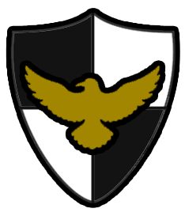

# NYC-311-Map-App

An Android/iOS app written in React Native that populates a map with recent 311 incidents in New York City. Made as part of the first NYC CS4All Hack League.

## Demo

## Expo Snack

This project can also be found as an Expo snack at https://snack.expo.io/@ericthestein/311-map
From here, you can immediately run it on a physical or simulated Android/iOS device.

## Built With

* [React Native](https://facebook.github.io/react-native/) - iOS/Android Cross-Platform Framework
* [Expo](https://expo.io/) - SDK and workflow
* [NYC's Open 311 Dataset](https://developer.cityofnewyork.us/) - Provider of data

## Authors

* **Eric Stein** - *Lead Programmer, Lead Designer*
* **Matthew Vaysfeld** - *Programmer*
* **Adam Bougaev** - *Programmer*
* **Sameer Jain** - *Designer*
* **Dong Yang** - *Designer*

## License

This project is licensed under the GNU License - see the [LICENSE.md](LICENSE.md) file for details

## Acknowledgments

* Dr. Joseph Frusci, Hackathon adult supervisor
